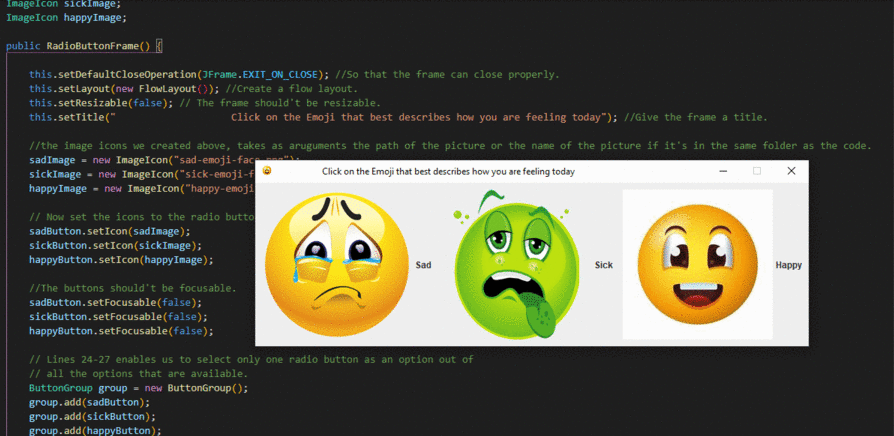

# GUI-Moods

### This is just a simple GUI application that asks the user how they're feeling on that particular day, where the user can click on the emoji that illustrates how they're feeling and then there will be a pop up message for the user.

## Description

### On this we make use of the JFrame, JRadioButton, JOptionPane and we also implement the ActionListener.

